本文实现了从项目调研、数据收集、数据预处理、深度卷积神经网络训练再到服务器部署，实现了一个**人脸表情识别**的小项目，非常适合一直在学习，但是找不到合适的练手项目的同学。

### 0  项目成果

先展示一下我的结果。我们测试的图片当然是当前最热的 nihongo  电视剧『轮到你了』的 CP 二阶堂和黑岛了

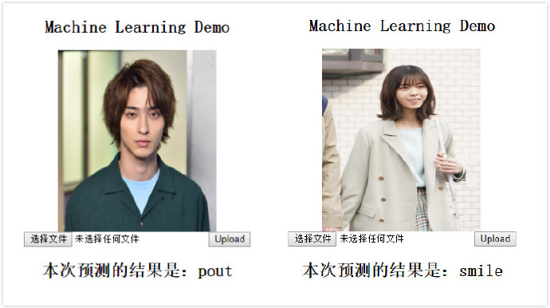

有兴趣的朋友可以**扫码进行体验**，会跳转到我的网站，选择图片文件上传，Upload 后就会返回预测结果，其中 `smile` 表示微笑，`pout` 表示嘟嘴，`no-smile` 表示中性表情。那么接下来就开始我们整个项目的讲解了


本项目整理完成后会上传所有代码到 Github 上，会有详细的代码注释，欢迎查阅！https://github.com/FLyingLSJ/

### 1  说在前面

作为一名机器学习的爱好者，提升自己的最好的方式就是参与一项项目，那么什么才能够称作项目呢？训练过 MNIST 数据集？做过 dogs VS. cats？想必这很难被称作一个项目，放在简历上，想必不能让 HR 看到闪光点， 之前有幸阅读到陈老师的『接地气学堂』的文章《我没有项目经验，怎么办？》，里面很详细的介绍了什么项目的定义、个人在项目中的角色、以及判断项目的成败等等，非常具有启发性。简单总结如下：

- 项目定义：给定时间费用的限制，达成特定的目的的工作
- 个人在项目中的角色：参与（某个环节）、主导（负责人）、独立承担
- 判断项目成败：开头的目标是什么，达成了就算成功，没达成就算失败。就算没有参加整个项目的流程，也需要关注子项目（自己做的部分）的成败
- 项目的是否高级：在规定时间、费用范围内产出更大的、投入更少的，都是“高级”项目；产出率低，耗时耗力多的就是“低级”项目

我将其做成了思维导图，可以在后台回复 `思维导图` 获取

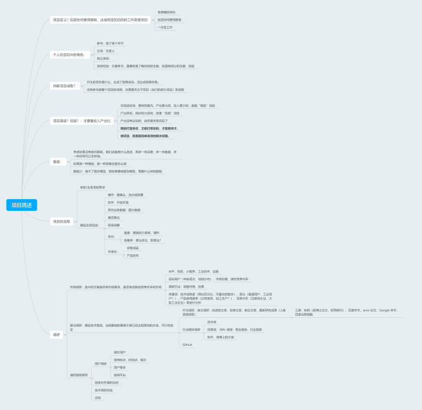

作为机器学习爱好者，并且以后想从事相关工作的我一直在思考如何创造出一个项目来，尽可能的去模拟企业开发产品的流程，让自己提前以实际开发者的心态来开发一款产品或者服务。于是我选择以**人脸表情识别**做为我的实战项目

### 2.  为什么是人脸表情分类

机器学习入门时我们一般是以现成的数据集，官方的 Demo 作为开始，一步步调节参数，达到我们所需要的精度。但是在实际的企业开发流程中，往往涉及到流程之多，工程问题的细节也非常多（虽然我现在也是学生，但是据我了解大致的流程应该也差不多）

- 老板/业务发起需求
- 确定业务组成
- 项目调研：市场调研、算法调研
- 确定算法及收集数据
- 确定框架、基准模型
- 服务端部署

人脸表情分类整个项目涉及到几个方面，如数据采集、数据预处理、人脸检测、人脸关键点检测、深度学习模型训练、模型在线部署等，不仅涉及到传统的机器学习，也与深度学习的相关知识紧密结合。故以人脸表情识别作为实战再合适不过了

### 3. 项目调研

开始一个项目之前，肯定是做调研啦，调研包括**市场调研**和**算法调研**

- 市场调研

市场调研需要了解市面上有没有相似的服务或者产品，如 APP、小程序、网页等；选中的方案是否有市场需求，是否有成熟的竞争对手和市场；看看我们所服务的内容的目标用户（年龄层次、地域分布）、市场份额以及潜在的竞争对手、是否已经达到落地水准。没有充分的调研，有可能你的产品做出来了，但是其实市场上已经有成熟的产品，那么前期投入的所有资源都白白浪费。所谓**人无我有、人有我优、人优我廉、人廉我走** ，做到知根知底，不至于做出来时心里落差太大

当然，对于我们这个小型的项目可能并不需要有上面的整个流程，但是大致也相似，我们需要了解市场上相似的产品，这里当然就是市面上有没有人脸表情识别的软件、小程序、API 等等

在此之前，我们先简单介绍一下人脸表情识别的几个应用场景

1. 微表情在情绪识别任务上的可靠度很高, 对表情情感识别任务有潜在的利用价值, 如婚姻关系预测、交流谈判、教学评估等.除了用于情感分析, 研究人员观察到了有意说谎时产生的微表情经过微表情识别训练, 普通人识别说谎的能力得到提高
2. 在金融领域，有报道显示，将微表情结合知识图谱的指南回答引擎，可以识别银行客户是否有欺诈风险
3. 智能家居：识别用户的行为，智能调节电器，更具智能化
4. 自动驾驶：监测分析驾驶过程中出现的分心、疲劳以及相关负面情绪波动，结合驾驶辅助系统提升驾驶安全
5. 教育领域：实时测量学习者对学习内容与学习过程中的情绪变化（如注意力集中、理解困惑、厌恶度等）

接下来就是现有产品的测试啦！

- 百度 AI 体验中心

  在微信小程序搜索 百度 AI 体验中心，可以体验人脸与人体识别、语音技术等功能
  
  
  
- 旷视人工智能平台

  在旷视人工智能平台 https://www.faceplusplus.com.cn/emotion-recognition/  申请表情识别的 API 进行测试，测试结果如下：在返回的结果中，微笑的程度是一个值为 [0,100] 的浮点数，小数点后 3 位有效数字。数值越大表示笑程度高。在程序处理中，我设定阈值为 60 ，即大于 60 就认为是微笑表情。

  

- 其他：面向企业的产品

希亚思（上海）信息技术有限公司：http://www.cacshanghai.com/www/index.php?m=page&f=view&pageID=124

平安云：https://yun.pingan.com/ssr/smart/WBQ 

其中平安银行在 <u>微表情国际权威评测OMG微表情竞赛</u> 上获得第一名，可见平安银行在人脸表情识别上的技术突破。

以及最近很火的 ZAO ，也是和人脸识别有关的～


- 算法调研

完成市场调研，接下来就是算法调研了，所谓的算法调研就是我们现在做的项目所使用的算法是什么，所能达到的精度如何

主要从几个方面入手：Paper 看看别人的文章，在知网或者 Google 学术上都能找到相关的文章，找找有没有相关的竞赛或者数据集，行业媒体报道也是一种手段，比如虎嗅、36Kr 都会发布相关的行业深度文章。

- 人脸微表情识别综述：http://html.rhhz.net/ZDHXBZWB/html/20170302.htm
- 基于SIFT算法的多表情人脸识别：http://html.rhhz.net/YJYXS/html/yj20161209.htm

并且看一下 Github 上面上是否已经有相关的开源项目

### 4. 数据收集

巧妇难为无米之炊，没有数据集的支撑，那么再厉害的深度学习模型也寸步难行，在开始训练模型之前我们要收集数据，基本的思路是先看看是否有开源数据集、若没有开源数据集，那么考虑互联网这个大宝库进行爬虫采集

本项目主要识别三种表情，分别是**微笑、嘟嘴、中性表情**，故我们所需要的数据也是围绕这三个表情展开的

首先，我们查找开源的数据集，可以从各大竞赛平台开始，比如 Kaggle 本身就是一个数据大宝库，我们发现在 Kaggle 上有个 `CelebFaces Attributes (CelebA) Dataset`  竞赛，里面提供的数据包含 202599 张图片，每张图片共有 40 个属性，我们用到其中的 smiling 属性，每个类别选取 5-6k 图片，把图片拆分成微笑表情和中性表情两个文件夹

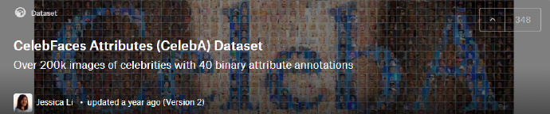

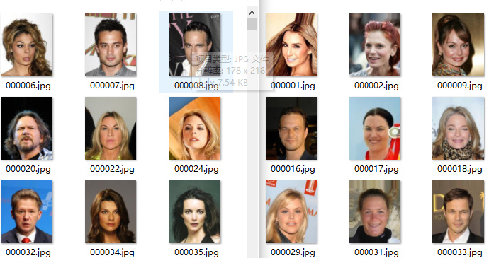

在采集到微笑和中性表情以后，接下来就是寻找有关嘟嘴的表情，笔者在网络上搜了一圈，找不到有关嘟嘴的表情，那么接下来考虑爬虫采集了。若你没有爬虫相关的知识，那么要在这一步就停滞不前了吗？不！Github 总有你要的资源～

本项目使用的以下开源的图片爬虫项目：关键词 “嘟嘴 pout” 

- https://github.com/sczhengyabin/Image-Downloader

  下载下来为一个 exe 文件，运行并设置关键的参数，就可以从三大搜索引擎中爬取相关的图片

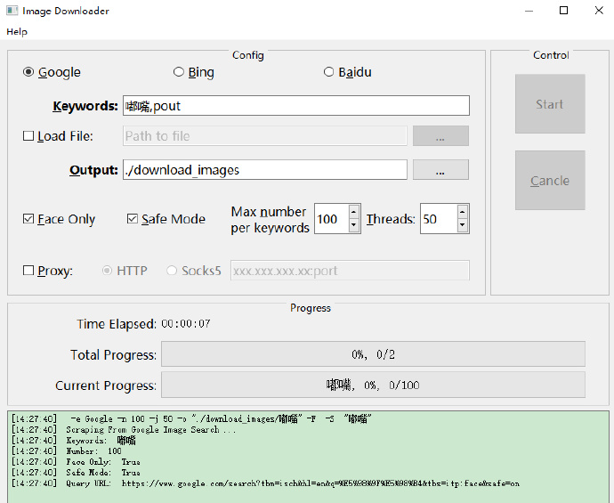

- https://github.com/kong36088/BaiduImageSpider：该项目只要下载下来，修改你要下载图片的关键词就能从百度上下载图片

通过以上方法，我从互联网上爬取了 1200+ 图片作为“嘟嘴”表情的训练集

### 5. 数据预处理

上一步中，我们从不同渠道获取到了训练集，那么在训练模型之前要对数据集进行清洗与整理，大致包括以下几个方面（详细可以参见下面的思维导图，注：思维导图中的内容整理自《深度学习之图像识别--核心技术与案例实战》作者：言有三）

- 数据规范化处理
- 数据整理分类
- 数据去噪
- 数据去重
- 数据存储与备份

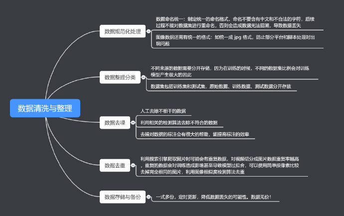

数据处理在整个项目中占比的时间也非常多、处理起来比较繁琐但是却是关键的一环，笔者在这个步骤花费了不少时间。

最终获取到的图像如下所示，那是不是意味着我们就可以马上开始搞模型，就开始训练了，事实上并非如此。如果有对微表情有了解的同学应该知道，人脸的表情是由面部结构决定的，如嘴巴、眉毛、眼睛、鼻子都会影响表情的表达，在本项目中，我们想实现的是嘴巴区域对表情的决定性，故我们可以将问题进行简化，我们只关注嘴巴的区域，这一区域影响了我们表情的表达。

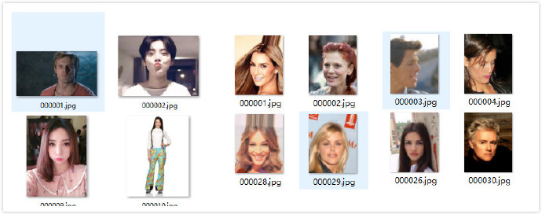

对此，我们可以对采集下来的图像进行进一步的处理，把嘴巴区域给裁剪出来，作为我们模型的输入，一般裁剪下来的图片在 60-70 分辨率左右，对比把原图送进模型训练，这样子做大大降低了我们模型的训练时间。现在有很多人脸检测算法已经相当成熟，我们使用的是 `OpenCV`＋`dlib` 这两个图片处理的库。在开始之前，我们需要安装他们，对于 OpenCV 安装比较简单，而对于 dlib 的安装，我们给出 Windows 和 Linux 下的安装方法，安装之前需要去 `https://pypi.org/simple/dlib/` 下载与设备向匹配的 whl 文件，通过 whl 的方法进行安装

```bash
# Windoes 和 Linux 下安装 OpenCV
pip install opencv-python 
# 若出现：libXrender.so.1: cannot open shared object file: No such file or directory
# 考虑安装下面的包
apt-get install libsm6
apt-get install libxrender1
apt-get install libxext-dev

# Windows 下安装 dlib 
pip install *.whl   # * 是下载下来的 whl 文件的名字，安装过程比较缓慢，请耐心等待

# Linux 下安装 dlib
sudo apt-get install build-essential cmake
sudo apt-get install libgtk-3-dev
sudo apt-get install libboost-all-dev
pip install dlib

```

经过关键点检测后，得到的效果如下所示，在本文中，我们使用的是 68 关键点检测，故只要提取出标号 48-67 的点周围的区域（嘴巴区域）即可

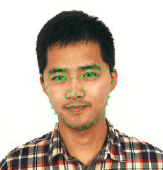

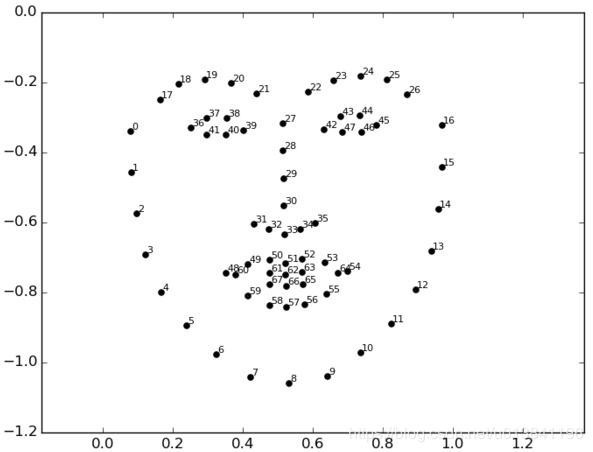

最终得到的结果如下所示：数据集大小是：微笑和中性表情各 1000 张，嘟嘴表情经过处理以后最终剩下 761 张

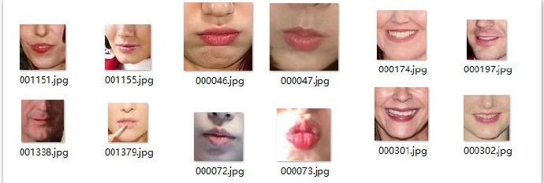

我们对数据集进行 9:1 的比例进行拆分，拆分成训练集和测试集

### 6. 选择框架基准模型

得到我们目标的数据集，那么下一步就是着手开始训练了，我们选择 **Pytorch** 这个深度学习框架，之后我们需要确定一个**基准模型**，由于我们的数据数量上并不是很多。若想要将深度学习应用于小型图像数据集，一种常用且非常高效的方法是使用预训练网络。预训练网络（pretrained network）是一个保存好的网络，之前已在大型数据集（通常是大规模图像分类任务）上训练好。如果这个原始数据集足够大且足够通用，那么预训练网络学到的特征的空间层次结构可以有效地作为视觉世界的通用模型，因此这些特征可用于各种不同的计算机视觉问题，即使这些新问题涉及的类别和原始任务完全不同。举个例子，你在 ImageNet 上训练了一个网络（其类别主要是动物和日常用品），然后将这个训练好的网络应用于某个不相干的任务，比如在图像中识别家具。这种学到的特征在不同问题之间的可移植性，是深度学习与许多早期浅层学习方法相比的重要优势，它使得深度学习对小数据问题非常有效

一句话总结上面这一段就是，**使用别人在大规模数据上训练的模型好参数，我们只修改最后的分类参数，然后应用到我们的数据集上**，通常效果并不差，但是，由于我们的输入数据较小（只包含嘴巴区域，图像的像素在 50×50 左右，经典的神经网络的输入是 224×244 ），不能符合大部分基准模型的输入要求，故自行设计了一个简单的卷积神经网络，Pytorch 框架的代码如下：

```python
class simpleconv3(nn.Module):
    def __init__(self):
        super(simpleconv3,self).__init__()
        self.conv1 = nn.Conv2d(3, 12, 3, 2)
        self.bn1 = nn.BatchNorm2d(12)
        self.conv2 = nn.Conv2d(12, 24, 3, 2)
        self.bn2 = nn.BatchNorm2d(24)
        self.conv3 = nn.Conv2d(24, 48, 3, 2)
        self.bn3 = nn.BatchNorm2d(48)
        self.fc1 = nn.Linear(48 * 5 * 5 , 1200)
        self.fc2 = nn.Linear(1200 , 128)
        self.fc3 = nn.Linear(128 , 3)

    def forward(self , x):
        x = F.relu(self.bn1(self.conv1(x)))
        #print "bn1 shape",x.shape
        x = F.relu(self.bn2(self.conv2(x)))
        x = F.relu(self.bn3(self.conv3(x)))
        x = x.view(-1 , 48 * 5 * 5) 
        x = F.relu(self.fc1(x))
        x = F.relu(self.fc2(x))
        x = self.fc3(x)
        return x
```


### 7. 模型训练

由 ResNet18  作为基准模型，冻结所有的卷积层，只更改最后的分类器，以 Adam 优化器训练 500 个轮次得到如下结果，精度在 **90%** 左右，由于使用的是其他深度学习平台的算力，平台暂时无法下载训练结果的图片，所以截图了模型的训练精度及验证精度如下，总共 500 个轮次，可以看出在 260batch 左右网络就已经收敛了

模型训练精度曲线

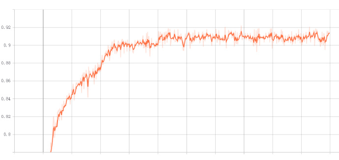

模型验证精度曲线

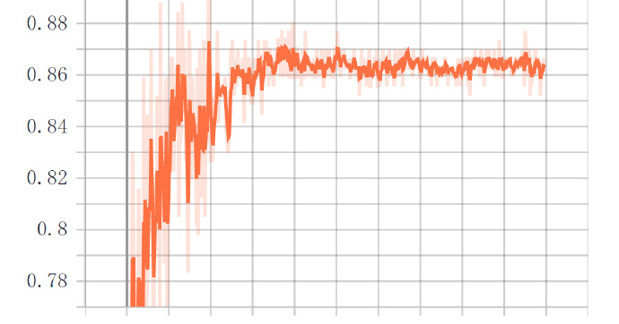

### 8. 服务器部署

- 前端

  模型训练完成以后，我们得到了一个以 `.ckpt` 为后缀的模型文件，我们将这个模型放到服务器，为了得到友好的交互，我们需要编写前端和后端处理的程序，前端我们使用的是 Flask 框架，根据官方的教程 `https://dormousehole.readthedocs.io/en/latest/ `结合 html 的模板，我们很快就能搭建出一个简单的 web 界面，包括一个上传文件按钮和图片显示页面以及文字描述等，整体效果如下：

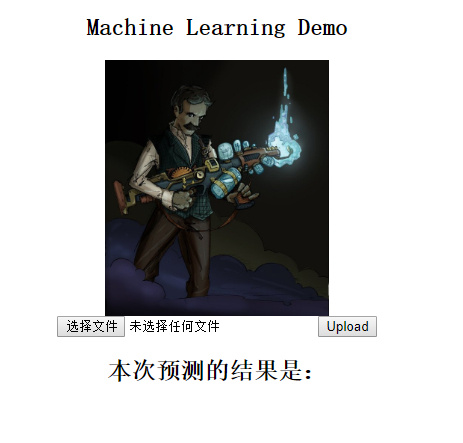

	代码如下：

```python
from flask import Flask, request
from flask import render_template
import time
from expression_demo import expression_predict  # 表情预测项目

system_path = "./"
app = Flask(__name__)  # 创建一个 Flask 实例，使用单一模块，应该使用 __name__

@app.route('/')
def hello(imgPath=None):
    return render_template('index.html', imgPath=system_path+"static/image/logo.jpg")

@app.route('/upload', methods=['POST'])
def upload(imgPath=None, result="None"):
    file = request.files['file']
    fileName = file.filename
    filePath = system_path+"static/image/"+fileName    # 图片路径
    if file:
        file.save(filePath)
        result = expression_predict(filePath)
        if result is None:
            result = "could not found your beauty face"
        return render_template('index.html', imgPath=system_path+"static/image/"+fileName, result=result)
    else:
        return render_template('index.html', imgPath=system_path+"static/image/logo.jpg")

if __name__ == '__main__':
    app.run(host="0.0.0.0") # 
```

- 后端处理

  后端处理就是对用户上传的图片进行处理，包括我们前期所作的一些工作，如：读取用户上传的图片、进行人脸检测、人脸关键点检测、图片裁剪以及预测返回等操作，我们将预测功能封装成一个函数，然后在主函数中直接调用即可，以后的每一个项目都封装成单独的一个函数，直接做调用就能实现相关的功能

```python
from expression_demo import expression_predict  # 表情预测项目，将所有处理的函数写在一个 py 文件中，在主函数中进行导入
```

- 代码上传服务器

  将部署的代码上传至服务器，并将主代码运行至后台，这样，服务器就能一直工作了，将代码运行至后台的代码如下，其中 main.py 就是你的主要函数啦！


至此，所有的步骤都已完成！

### 9. 总结与思考

在本项目中，我们从 0 开始实现了一个人脸表情识别的项目，从项目调研、数据收集、数据预处理、人脸检测、深度学习模型的训练再到前端编写、服务器部署等，基本上走过了一款小产品开发的所有流程。

在公司里面，可能一个项目有不同方向的员工参与，如前端工程师、后端工程师、算法工程师等，但是自己做项目的话，整个流程都需要你自己做，相当于全栈工程师的工作量，是对个人能力很好的锻炼，整个流程做下来，多多少少都会遇见不少的坑，但是只要耐心去解决，都是很好的成长机会，就像笔者对前端和服务端的知识并不熟悉，在其中遇到了非常多的坑。在往下思考，其实本项目还是有很多需要思考的地方

这些都是实实在在的痛点所在，如下：

- 光照角度、侧脸等都会影响到人脸的检测，从而影响后续的预测结果
- 如何继续提高模型的精度
- 服务端遇到大的请求如何处理
- WEB 端的一些请求的逻辑处理等等

由于个人知识水平有限，欢迎提出意见～

参考：
- 《深度学习之图像识别--核心技术与案例实战》作者：言有三
- https://github.com/tinypumpkin/face_process
- https://github.com/foamliu/Facial-Expression-Prediction
- http://www.cvmart.net/community/article/detail/211
- https://www.thoughtworks.com/insights/blog/emopy-machine-learning-toolkit-emotional-expression
- https://www.digitalocean.com/community/tutorials/how-to-serve-flask-applications-with-uswgi-and-nginx-on-ubuntu-18-04
- https://www.digitalocean.com/community/tutorials/how-to-install-nginx-on-ubuntu-18-04#step-4-–-managing-the-nginx-process


欢迎关注：`机器视觉CV` 公众号


