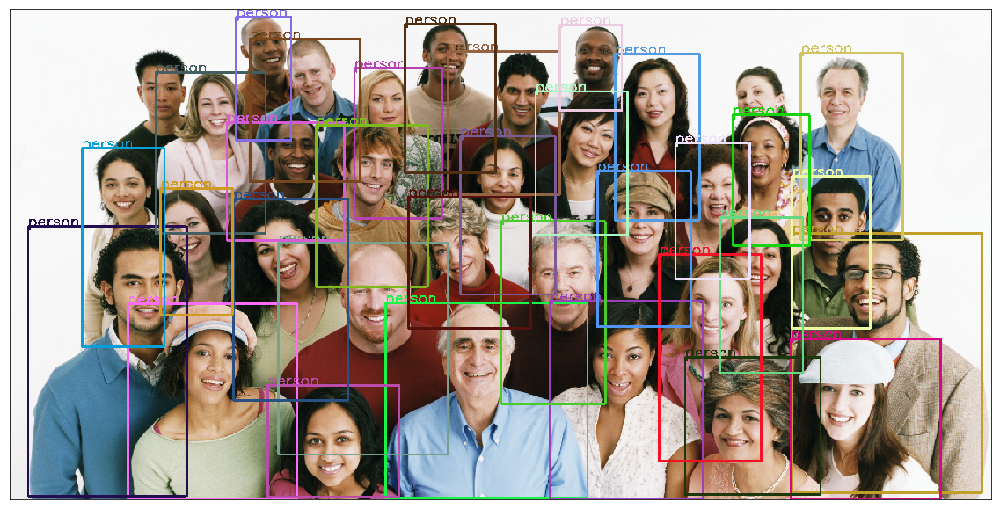
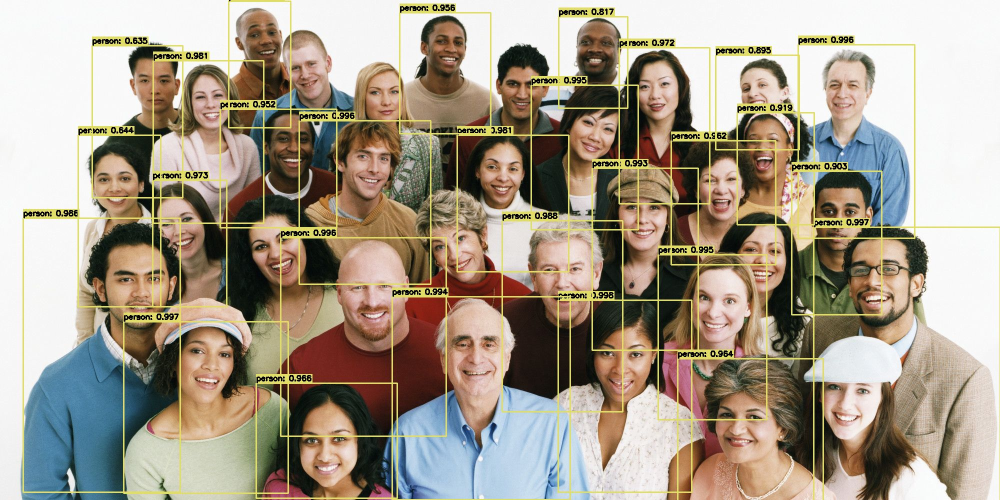

# Fater R-CNN 目标检测体验篇

上次我们分享了目标检测 One-Stage 的代表 YOLO，从体验、理论到代码实战。其实 One-Stage 还有一个代表是 SSD ，这个等到下一次我们再讲解，因为 SSD 涉及到部分 Two-Stage 目标检测的知识。

本期我们分享的是 Two-Stage 的代表作 Fater R-CNN ，这是属于 R-CNN 系列中比较经典的一个，目前比较流行。今天我们就带大家体验一把 Faster R-CNN 的检测，代码不多。


### 代码说明

我们代码使用的是 Pytorch 提供的目标检测模型 `fasterrcnn_resnet50_fpn`

```python
model = torchvision.models.detection.fasterrcnn_resnet50_fpn(pretrained=True)
```

模型预测后得到的结果是

- Bounding boxes [x0, y0, x1, y1]  边框的四个值
- Labels 所有预测的标签
- Scores 所有标签的分数

以下就是本次内容的所有代码：

```python
import torchvision  # 0.3.0  version  这里指的是所使用包的版本
from torchvision import transforms as T
import cv2  # 4.1.1  version
import matplotlib.pyplot as plt  # 3.0.0  version
from PIL import Image  # 5.3.0  version
import random
import os
import torch

device = torch.device("cuda" if torch.cuda.is_available() else "cpu")
model = torchvision.models.detection.fasterrcnn_resnet50_fpn(pretrained=True).to(device)  #  加载模型
model.eval()  # 设置成评估模式

# 定义 Pytorch 官方给的类别名称，有些是 'N/A' 是已经去掉的类别
COCO_INSTANCE_CATEGORY_NAMES = [
    '__background__', 'person', 'bicycle', 'car', 'motorcycle', 'airplane', 'bus',
    'train', 'truck', 'boat', 'traffic light', 'fire hydrant', 'N/A', 'stop sign',
    'parking meter', 'bench', 'bird', 'cat', 'dog', 'horse', 'sheep', 'cow',
    'elephant', 'bear', 'zebra', 'giraffe', 'N/A', 'backpack', 'umbrella', 'N/A', 'N/A',
    'handbag', 'tie', 'suitcase', 'frisbee', 'skis', 'snowboard', 'sports ball',
    'kite', 'baseball bat', 'baseball glove', 'skateboard', 'surfboard', 'tennis racket',
    'bottle', 'N/A', 'wine glass', 'cup', 'fork', 'knife', 'spoon', 'bowl',
    'banana', 'apple', 'sandwich', 'orange', 'broccoli', 'carrot', 'hot dog', 'pizza',
    'donut', 'cake', 'chair', 'couch', 'potted plant', 'bed', 'N/A', 'dining table',
    'N/A', 'N/A', 'toilet', 'N/A', 'tv', 'laptop', 'mouse', 'remote', 'keyboard', 'cell phone',
    'microwave', 'oven', 'toaster', 'sink', 'refrigerator', 'N/A', 'book',
    'clock', 'vase', 'scissors', 'teddy bear', 'hair drier', 'toothbrush'
]


#  获取单张图片的预测结果
def get_prediction(img_path, threshold):
    img = Image.open(img_path)  # Load the image  加载图片
    transform = T.Compose([T.ToTensor()]) # Defing PyTorch Transform
    img = transform(img)  # Apply the transform to the image  转换成 torch 形式
    pred = model([img.to(device)])  # Pass the image to the model  开始推理
    pred_class = [COCO_INSTANCE_CATEGORY_NAMES[i] for i in list(pred[0]['labels'].cpu().numpy())]  # Get the Prediction Score  获取预测的类别
    pred_boxes = [[(i[0], i[1]), (i[2], i[3])] for i in list(pred[0]['boxes'].detach().cpu().numpy())]  # Bounding boxes  获取各个类别的边框
    pred_score = list(pred[0]['scores'].cpu().detach().numpy())  #  获取各个类别的分数
    
    # Get list of index with score greater than threshold.
    pred_t = [pred_score.index(x) for x in pred_score if x > threshold][-1]  #  判断分数大于阈值对于的分数的最大索引
    #  因为预测后的分数是从大到小排序的，只要找到大于阈值最后一个的索引值即可
    pred_boxes = pred_boxes[:pred_t+1]  
    pred_class = pred_class[:pred_t+1]
    return pred_boxes, pred_class


#  根据预测的结果绘制边框及类别
def object_detection_api(img_path, threshold=0.5, rect_th=3, text_size=3, text_th=3):
    boxes, pred_cls = get_prediction(img_path, threshold)  # Get predictions
    img = cv2.imread(img_path)  # Read image with cv2
    img = cv2.cvtColor(img, cv2.COLOR_BGR2RGB)  # Convert to RGB
    result_dict = {}  #  用来保存每个类别的名称及数量
    for i in range(len(boxes)):
        color = tuple(random.randint(0, 255) for i in range(3))
        cv2.rectangle(img,
                      boxes[i][0],
                      boxes[i][1],
                      color=color,
                      thickness=rect_th)  # Draw Rectangle with the coordinates

        cv2.putText(img,
                    pred_cls[i],
                    boxes[i][0],
                    cv2.FONT_HERSHEY_SIMPLEX, 
                    text_size,  
                    color,
                    thickness=text_th)  # Write the prediction class
        
        #  将各个预测的结果保存到一个字典里
        if pred_cls[i] not in result_dict:
            result_dict[pred_cls[i]] = 1
        else:
            result_dict[pred_cls[i]] += 1
        print(result_dict)
    plt.figure(figsize=(20, 30))  # display the output image
    plt.imshow(img)
    plt.xticks([])
    plt.yticks([])
    plt.show()


if __name__ == "__main__":
    object_detection_api('./people.jpg', threshold=0.5)

```

---


### 实验效果


我们分别在 FasterR-CNN 和 YOLO 下进行测试，测试结果如下：
都存在漏检的情况，这里我们只是简单的做个比较，等 Faster R-CNN 更新结束后，我们再统一来分析两者的差别

---



---




---

大家如果不想找测试图片的话，这里给大家提供几张

```bash
wget https://www.wsha.org/wp-content/uploads/banner-diverse-group-of-people-2.jpg -O people.jpg
wget https://hips.hearstapps.com/hmg-prod.s3.amazonaws.com/images/10best-cars-group-cropped-1542126037.jpg -O car.jpg
wget https://cdn.pixabay.com/photo/2013/07/05/01/08/traffic-143391_960_720.jpg -O traffic.jpg
wget https://images.unsplash.com/photo-1458169495136-854e4c39548a -O girl_cars.jpg
```


参考： https://www.learnopencv.com/faster-r-cnn-object-detection-with-pytorch/ 