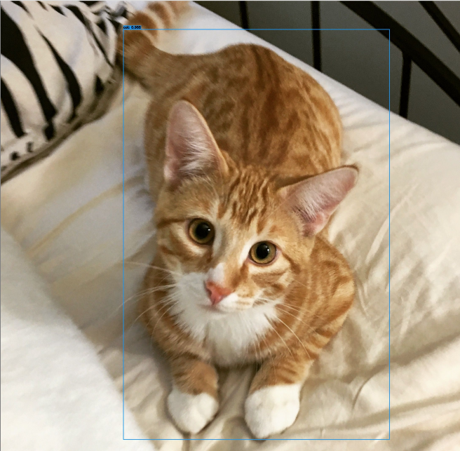
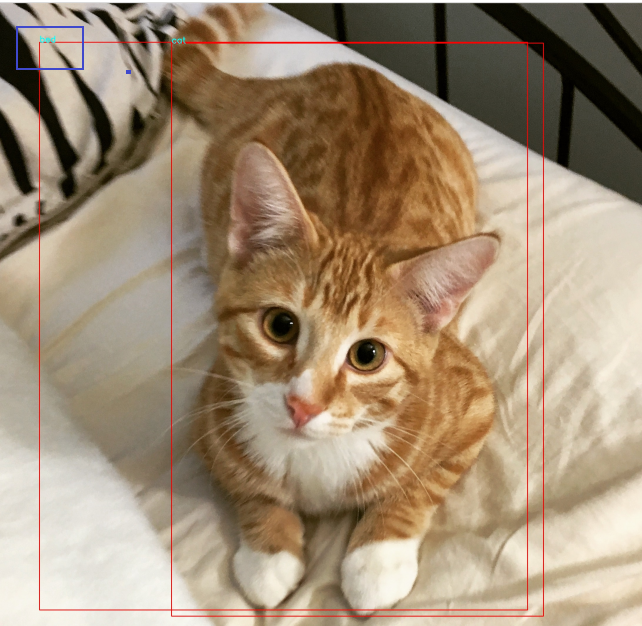
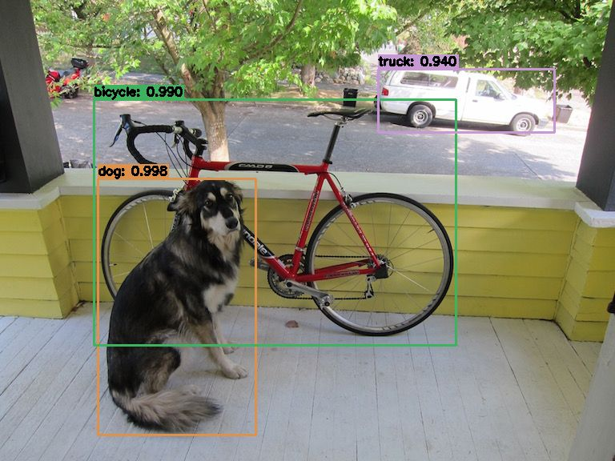

我们上次分享过 YOLO 实现目标检测，但是，当笔者今天再测试时发现里面竟然存在一个有趣的 BUG

但我重新运行目标检测的程序时，测试了以下这只可爱的猫咪：



此时我就在想，目标检测不是要经过一步 NMS（非极大值抑制）吗，才能得到最后的输出框，那么我可不可以在还没有经过 NMS 时，把所有的锚框都绘制出来呢，那就动手吧




###### BUG 分析

WHAT，怎么还有个 bed （上图左上角那个蓝色框框）给画出来，但是预测的时候却没有呢，于是我又回顾了一遍 **非极大值抑制（NMS）算法**：从输出结果中提取最有可能的对象和其对应的边界框。流程如下：

- 1.设置一个 Score 的阈值，一个 IOU 的阈值（overlap）；

- 2.对于**每类**对象，遍历属于该类的所有候选框，

  ① 过滤掉 Score 低于 Score 阈值的候选框；

  ② 找到剩下的候选框中最大 Score 对应的候选框，添加到输出列表；

  ③ 进一步计算剩下的候选框与 ② 中输出列表中每个候选框的 IOU，若该 IOU 大于设置的 IOU 阈值，将该候选框过滤掉（大于一定阈值，代表重叠度比较高），否则加入输出列表中；

  ④ 最后输出列表中的候选框即为图片中该类对象预测的所有边界框

- 3.返回步骤 2 继续处理下一类对象。

看着没毛病是吧，那我们就看看 OpenCV 的非极大值抑制是怎么实现的吧

```python
indices	=	cv.dnn.NMSBoxes(bboxes, scores, score_threshold, nms_threshold[, eta[, top_k]])
# bboxes，scores 分别是经过 YOLO 检测后，得到所有候选框及其分数
# score_threshold 是我们设定的要选定的候选框的分数值
# nms_threshold 是我们设定的 NMS 的参数，也就是两个边界框的 IoU 
```

咦！不是说对每类的对象执行非极大值抑制操作吗，怎么没有各个类别的参数输入？？？

难道是 OpenCV 的 BUG（/兴奋脸）？还是另有所用？

既然遇见了这个问题，那么，我们就把这个 BUG 给填上呗！

先上代码

```python
def NMSBoxes_fix(boxes, confidences, confidence_thre, nms_thre, class_id):
    class_id_set = set(class_id)  #  总共有几类
    result = []  #  用来存储结果的
    for cls in class_id_set:  # 遍历每个类别
        cls_boxes = []  # 用来保存每个类别的  边框
        cls_confidences = []  # 用来保存每个类别边框的分数
        indices = [i for i, c in enumerate(class_id) if c == cls] # 某一类在原始输入的所有索引
        for i in indices:
            cls_boxes.append(boxes[i])  # 把属于该类的框框和分数找出来
            cls_confidences.append(confidences[i]) 
        idxs = cv2.dnn.NMSBoxes(cls_boxes, cls_confidences, confidence_thre, nms_thre)  # 对每类进行 NMS 操作
        for i in idxs:  #  找出原始输入的索引，并把经过 NMS 操作后保留下来的框框的索引保存下来到一个列表中
            result.append([indices[i[0]]])  #  
    return np.array(result)  #  opencv 原始的 NMS 输出是一个 np.array 的数据，所以我们也将其转化成指定格式
```

其实很简单，我们只要先把每个类别对应的框框找出来，然后对其进行 NMS 操作，最后，将各个类别经过 NMS 操作的结果合并起来输出即可。

写好了代码，我们测试一下我们的结果呗，用一张目标检测的常用测试图进行实验。

首先，我们设置一下我们实验的参数：

- nms_thre= 0.5   overlap 即 IoU 值 
- confidence_thre = 0.5  边框属于某个类别的分数的阈值

我们分别使用 OpenCV 自带的 NMS 操作和自己写的 MNS 操作进行对比，即：

```python
# 使用非极大值抑制方法抑制弱、重叠边界框
idxs = cv2.dnn.NMSBoxes(boxes, confidences, confidence_thre, nms_thre)

# 自己修正过的 非极大值抑制方法
idxs = NMSBoxes_fix(boxes, confidences, confidence_thre, nms_thre, classIDs)
```

得到的结果是一样的，因为图中 dog 区域在 bicycle 区域的 IoU 大概是 0.255，我们实验的值是 nms_thre=0.5 自然得到的结果是一样的



此时，我们改变实验的参数时：

- **nms_thre= 0.2**   overlap 即 IoU 值 
- confidence_thre = 0.5  边框属于某个类别的分数的阈值

这时，OpenCV 自带的 NMS 得到的结果如下图，原因是 dog 的分数比较高，在 OpenCV 进行 NMS 操作时（即不考虑类别时），会把分数较高的 dog 保留下来，而分数较低的 bicycle  给滤出掉

而使用我们**自己写的 NMS 操作**（考虑类别时）得到的结果还是同上面一样


###### 思考：

- 一张好的测试图片是如此的重要，要是没有那张可爱的猫咪图片，我也发现不了这个问题
- 现成的框架不一定是正确的，可能也得根据你的需求进行更改
- 多发现，对每步的处理知根知底

**要有打破沙锅问到底的决心**

完整的程序在 https://github.com/FLyingLSJ/Computer_Vision_Project 上，欢迎 Fork Star。