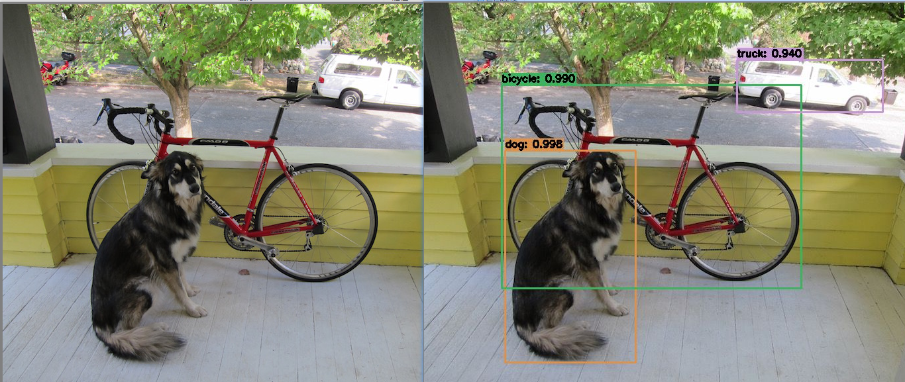
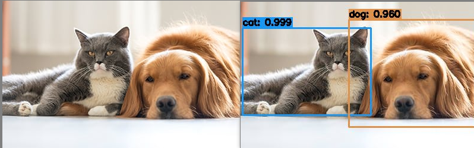

##### 什么是目标检测

目标检测（Object Detection）的任务是找出图像中所有感兴趣的目标（物体），确定它们的类别和位置，是计算机视觉领域的核心问题之一。由于各类物体有不同的外观、形状和姿态，加上成像时光照、遮挡等因素的干扰，目标检测一直是计算机视觉领域最具有挑战性的问题。

计算机视觉中关于图像识别有四大类任务：

**分类-Classification**：解决“是什么？”的问题，即给定一张图片或一段视频判断里面包含什么类别的目标。

**定位-Location**：解决“在哪里？”的问题，即定位出这个目标的的位置。

**检测-Detection**：解决“是什么？在哪里？”的问题，即定位出这个目标的的位置并且知道目标物是什么。

**分割-Segmentation**：分为实例的分割（Instance-level）和场景分割（Scene-level），解决“每一个像素属于哪个目标物或场景”的问题。


##### 目标检测初体验

当前基于深度学习的目标检测算法主要分为两类：

- **1.Two stage目标检测算法**：R-CNN、SPP-Net、Fast R-CNN、Faster R-CNN和R-FCN等。
- **2.One stage目标检测算法**：OverFeat、YOLOv1、YOLOv2、**YOLOv3**、SSD和RetinaNet等。

在本文中，我们将使用 YOLOv3 在检测图像类别的位置及名称。

我们将使用 Darknet （是一个用 C 和 CUDA 编写的开源神经网络框架。它快速，易于安装，并支持 CPU 和GPU 计算。）、 OpenCV 在 3.3.1 版本中开始支持 Darknet，我们在 Darknet 框架下训练出来的模型，通过 OpenCV 读取模型，从而进行预测。

在这里，我们假设大家没有目标检测的知识，只是想体验一下目标检测做出来的效果，有个大致的概念。为满足一下大家的好奇心，我们将从 Darknet 官网上（https://pjreddie.com/darknet/yolo/）下载官方已经训练好的 YOLOv3 模型，直接读取模型做目标检测。

首先，看一下我们的目录结构

```bash
└─ root
    │  code.py  				# 预测的代码
    ├─ cfg      				# 目标检测模型的配置文件
    │      coco.names  			# 各个类别的名称
    │      yolov3_coco.cfg  	# 目标检测网络的结构
    │      yolov3_coco.weights  # 目标检测模型的权重
    │
    ├─ result_imgs 				# 测试图片结果保存
    │      test1.jpg
    │      test2.jpg
    │      test3.jpg
    │      test4.jpg
    │
    └─ test_imgs  				# 测试图片
            test1.jpg
            test2.jpg
            test3.jpg
            test4.jpg
```

接下来上我们的代码：

```python
# -*- coding: utf-8 -*-
# 载入所需库
import cv2
import numpy as np
import os
import time

def yolo_detect(pathIn='',
                pathOut=None,
                label_path='./cfg/coco.names',
                config_path='./cfg/yolov3_coco.cfg',
                weights_path='./cfg/yolov3_coco.weights',
                confidence_thre=0.5,
                nms_thre=0.3,
                jpg_quality=80):

    '''
    pathIn：原始图片的路径
    pathOut：结果图片的路径
    label_path：类别标签文件的路径
    config_path：模型配置文件的路径
    weights_path：模型权重文件的路径
    confidence_thre：0-1，置信度（概率/打分）阈值，即保留概率大于这个值的边界框，默认为0.5
    nms_thre：非极大值抑制的阈值，默认为0.3
    jpg_quality：设定输出图片的质量，范围为0到100，默认为80，越大质量越好
    '''

    # 加载类别标签文件
    LABELS = open(label_path).read().strip().split("\n")
    nclass = len(LABELS)
    
    # 为每个类别的边界框随机匹配相应颜色
    np.random.seed(42)
    COLORS = np.random.randint(0, 255, size=(nclass, 3), dtype='uint8')
    
    # 载入图片并获取其维度
    base_path = os.path.basename(pathIn)
    img = cv2.imread(pathIn)
    (H, W) = img.shape[:2]
    
    # 加载模型配置和权重文件
    print('从硬盘加载YOLO......')
    net = cv2.dnn.readNetFromDarknet(config_path, weights_path)
    
    # 获取YOLO输出层的名字
    ln = net.getLayerNames()
    ln = [ln[i[0] - 1] for i in net.getUnconnectedOutLayers()]
    
    # 将图片构建成一个blob，设置图片尺寸，然后执行一次
    # YOLO前馈网络计算，最终获取边界框和相应概率
    blob = cv2.dnn.blobFromImage(img, 1 / 255.0, (416, 416), swapRB=True, crop=False)
    net.setInput(blob)
    start = time.time()
    layerOutputs = net.forward(ln)
    end = time.time()
    
    # 显示预测所花费时间
    print('YOLO模型花费 {:.2f} 秒来预测一张图片'.format(end - start))
    
    # 初始化边界框，置信度（概率）以及类别
    boxes = []
    confidences = []
    classIDs = []
    
    # 迭代每个输出层，总共三个
    for output in layerOutputs:
    	# 迭代每个检测
    	for detection in output:
    		# 提取类别ID和置信度
    		scores = detection[5:]
    		classID = np.argmax(scores)
    		confidence = scores[classID]
    
    		# 只保留置信度大于某值的边界框
    		if confidence > confidence_thre:
    			# 将边界框的坐标还原至与原图片相匹配，记住YOLO返回的是
                # 边界框的中心坐标以及边界框的宽度和高度
    			box = detection[0:4] * np.array([W, H, W, H])
    			(centerX, centerY, width, height) = box.astype("int")
    
    			
    			# 计算边界框的左上角位置
    			x = int(centerX - (width / 2))
    			y = int(centerY - (height / 2))
    
    			# 更新边界框，置信度（概率）以及类别
    			boxes.append([x, y, int(width), int(height)])
    			confidences.append(float(confidence))
    			classIDs.append(classID)
    
    # 使用非极大值抑制方法抑制弱、重叠边界框
    idxs = cv2.dnn.NMSBoxes(boxes, confidences, confidence_thre, nms_thre)
    
    # 确保至少一个边界框
    if len(idxs) > 0:
    	# 迭代每个边界框
    	for i in idxs.flatten():
            # 提取边界框的坐标
            (x, y) = (boxes[i][0], boxes[i][1])
            (w, h) = (boxes[i][2], boxes[i][3])
            
            # 绘制边界框以及在左上角添加类别标签和置信度
            color = [int(c) for c in COLORS[classIDs[i]]]
            cv2.rectangle(img, (x, y), (x + w, y + h), color, 2)
            text = '{}: {:.3f}'.format(LABELS[classIDs[i]], confidences[i])
            (text_w, text_h), baseline = cv2.getTextSize(text, cv2.FONT_HERSHEY_SIMPLEX, 0.5, 2)
            cv2.rectangle(img, (x, y-text_h-baseline), (x + text_w, y), color, -1)
            cv2.putText(img, text, (x, y-5), cv2.FONT_HERSHEY_SIMPLEX, 0.5, (0, 0, 0), 2)
    
    # 输出结果图片
    if pathOut is None:
        cv2.imwrite('with_box_'+base_path, img, [int(cv2.IMWRITE_JPEG_QUALITY), jpg_quality])
    else:
        cv2.imwrite(pathOut, img, [int(cv2.IMWRITE_JPEG_QUALITY), jpg_quality])
        

## 测试
pathIn = './test_imgs/test1.jpg'
pathOut = './result_imgs/test1.jpg'
yolo_detect(pathIn,pathOut)

```

运行结果如下：





以上源码可在 https://github.com/FLyingLSJ/Computer_Vision_Project 查看

参考：

- [https://github.com/scutan90/DeepLearning-500-questions/blob/master/ch08_%E7%9B%AE%E6%A0%87%E6%A3%80%E6%B5%8B/%E7%AC%AC%E5%85%AB%E7%AB%A0_%E7%9B%AE%E6%A0%87%E6%A3%80%E6%B5%8B.md](https://github.com/scutan90/DeepLearning-500-questions/blob/master/ch08_目标检测/第八章_目标检测.md)
- https://pjreddie.com/darknet/yolo/
- https://youtu.be/MPU2HistivI