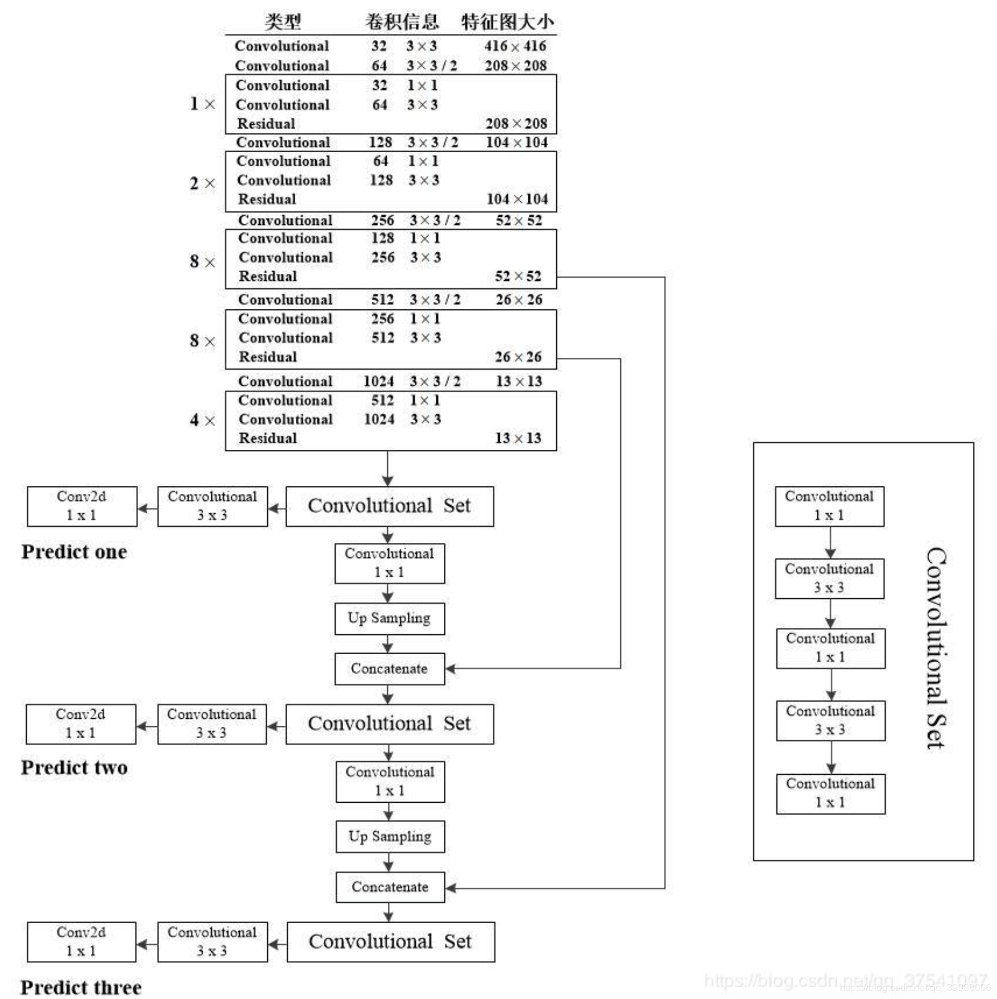

### 1. 读取数据配置文件 "config/custom.data"

该文件包括以下几个内容：

```python
classes= 1  # 目标检测的类别数量
train=data/custom/train.txt  # 训练集的图片名称，放在 train.txt 文件下，每一行是一张图片的名称
valid=data/custom/valid.txt  # 训练集的图片名称
names=data/custom/classes.names  # 每个类别的名字
```

### 2. 模型初始化（Darknet53）




- 读取模型配置文件 "config/yolov3.cfg" 里面是 Darknet53 的网络结构
- （其中需要注意的是 convolutional 层下的 pad 参数不是最终的填充参数，最终的 pad 参数是 size 参数经过运算得到的）
- 具体可以看：yolo 官方博客地址：https://blog.paperspace.com/how-to-implement-a-yolo-object-detector-in-pytorch/

### 3. 加载预训练模型的参数  "weights" 文件夹下

### 4. 数据加载器配置

### 5. 训练模型、保存模型等