### YOLO目标检测实战项目『原理篇』

##### 目标检测评价指标

-  IoU（Intersection-over-Union）指标 

 IoU 简称交并比，顾名思义数学中交集与并集的比例。假设有两个集合 A 与 B, IoU 即等于 A 与 B 的交集除以 A 与 B 的并集，表达式如下： 

 $IoU=A∩B/A∪B$

 在目标检测中，IoU 为预测框 (Prediction) 和真实框 (Ground truth) 的交并比。如下图所示，在关于小猫的目标检测中，紫线边框为预测框 (Prediction)，红线边框为真实框 (Ground truth)。 

 在目标检测任务中，通常取 IoU≥0.5，认为召回。如果 IoU 阈值设置更高，召回率将会降低，但定位框则更加精确。 

 理想的情况，当然是预测框与真实框重叠越多越好，如果两者完全重叠，则交集与并集面积相同，此时 IoU 等于 1。 

##### YOLOv1

2016.5 https://arxiv.org/pdf/1506.02640

###### YOLOv1 创新：

- 将整张图作为网络的输入，直接在输出层回归 bounding box 的位置和所属的类别（将对象检测作为一个回归问题）
- 速度快，one stage detection 的开山之作
- 速度快，one stage detection 的开山之作

之前的目标检测方法需要先产生候选区再检测的方法虽然有相对较高的检测准确率，但运行速度较慢。

YOLO 将识别与定位合二为一，结构简便，检测速度快，更快的 Fast YOLO 可以达到 155FPS。

###### YOLOv1 优缺点

- YOLO模型相对于之前的物体检测方法有多个优点：
  1、**YOLO 检测物体非常快。**
  因为没有复杂的检测流程，只需要将图像输入到神经网络就可以得到检测结果，YOLO可以非常快的完成物体检测任务。标准版本的 YOLO 在 Titan X 的 GPU 上能达到 45 FPS。更快的 Fast YOLO 检测速度可以达到 155 FPS 。而且，YOLO 的 mAP 是之前其他实时物体检测系统的两倍以上。
  2、**YOLO可以很好的避免背景错误，产生 false positives。**
  不像其他物体检测系统使用了滑窗或region proposal，分类器只能得到图像的局部信息。YOLO在训练和测试时都能够看到一整张图像的信息，因此YOLO在检测物体时能很好的利用上下文信息，从而不容易在背景上预测出错误的物体信息。和Fast-R-CNN相比，YOLO的背景错误不到Fast-R-CNN的一半。
  3、**YOLO可以学到物体的泛化特征。**
  当YOLO在自然图像上做训练，在艺术作品上做测试时，YOLO表现的性能比DPM、R-CNN等之前的物体检测系统要好很多。因为YOLO可以学习到高度泛化的特征，从而迁移到其他领域。

- 尽管YOLO有这些优点，它也有一些缺点：
  1、YOLO 的物体检测精度低于其他 state-of-the-art 的物体检测系统。

  2、YOLO 容易产生物体的定位错误。

  3、YOLO 对小物体的检测效果不好（尤其是密集的小物体，因为一个栅格只能预测 2 个物体）。

  4、召回率低
  
  5、YOLOv1 最大的劣势是不够精确 

###### 网络结构及检测流程

- 网络结构

YOLO 网络借鉴了 GoogLeNet 分类网络结构，不同的是 YOLO 使用 1x1 卷积层和 3x3 卷积层替代 inception module。如下图所示，整个检测网络包括24个卷积层和2个全连接层。其中，卷积层用来提取图像特征，全连接层用来预测图像位置和类别概率值。

- 检测流程

  - 先将图片缩放到固定尺寸 

  - YOLO 将输入图像划分为 S*S （论文中是 7×7）的栅格，每个栅格负责检测中心落在该栅格中的物体。

  - 每一个栅格预测 B （论文中是 2 个）个 bounding boxes（对每个边界框会预测 5 个值，分别是边界框的中心 x,y（相对于所属网格的边界），边界框的宽高 w, h（相对于原始输入图像的宽高的比例）），以及这些 bounding boxes 的 confidence scores。（边界框与 ground truth box 的 IOU 值）

  - 同时每个网格还需要预测 c （论文中的 c=20）个类条件概率 （是一个 c 维向量，表示某个物体 object 在这个网格中，且该 object 分别属于各个类别的概率，这里的 c 类物体不包含背景） 

  - 每个网格需要预测 2x5+20=30 个值，这些值被映射到一个 30 维的向量

  - YOLO最后采用非极大值抑制（NMS）算法从输出结果中提取最有可能的对象和其对应的边界框。（下面非极大抑制的流程）

    - 1.设置一个 Score 的阈值，一个 IOU 的阈值（overlap）；

    - 2.对于**每类对象**，遍历属于该类的所有候选框，

      ①过滤掉 Score 低于 Score 阈值的候选框；

      ②找到剩下的候选框中最大 Score 对应的候选框，添加到输出列表；

      ③进一步计算剩下的候选框与②中输出列表中每个候选框的IOU，若该 IOU 大于设置的 IOU 阈值，将该候选框过滤掉（大于一定阈值，代表重叠度比较高），否则加入输出列表中；

      ④最后输出列表中的候选框即为图片中该类对象预测的所有边界框

    - 3.返回步骤 2 继续处理下一类对象。
  
    >> 当overlap阈值越大、proposals boxes被压制的就越少，结果就是导致大量的FP(False Positives)，进一步导致检测精度下降与丢失(原因在于对象与背景图像之间不平衡比率，导致FP增加数目远高于TP)
    
    当overlap阈值很小的时候，导致proposals boxes被压制的很厉害，导致recall大幅下降。
    
    
    
    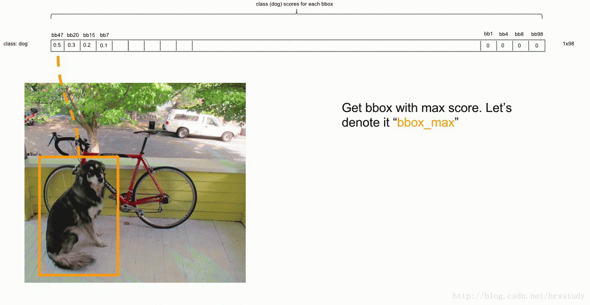

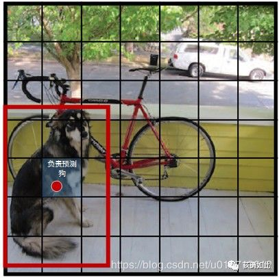

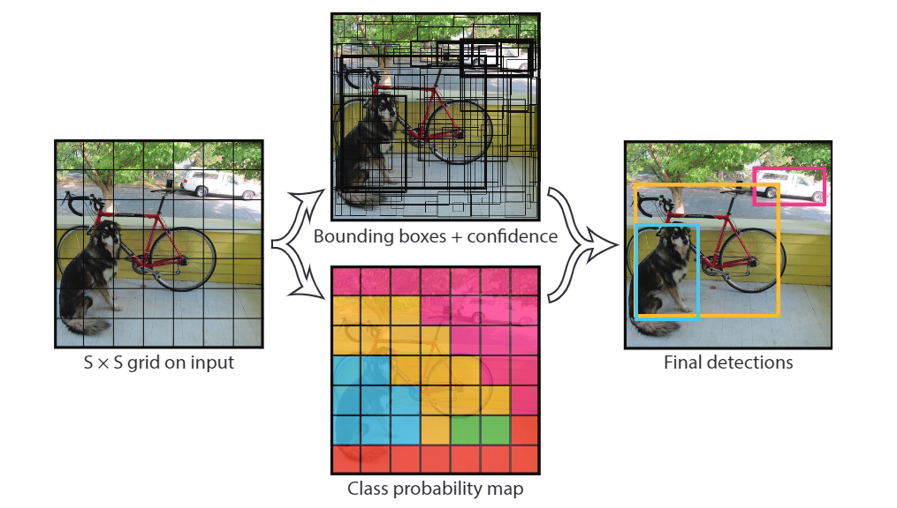

###### 输入输出、损失函数是什么

- 输入：论文中输入是 448×448 

- 损失函数

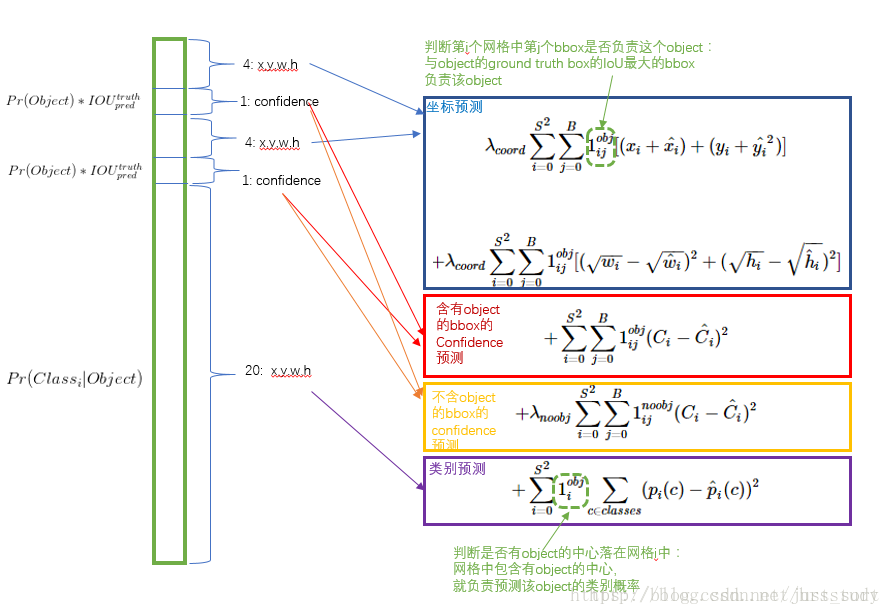

如上图所示，损失函数分为坐标预测（蓝色框）、含有物体的边界框的confidence预测（红色框）、不含有物体的边界框的confidence预测（黄色框）、分类预测（紫色框）四个部分。

由于不同大小的边界框对预测偏差的敏感度不同，小的边界框对预测偏差的敏感度更大。为了均衡不同尺寸边界框对预测偏差的敏感度的差异。作者巧妙的对边界框的 w,h 取均值再求 L2 loss. YOLO 中更重视坐标预测，赋予坐标损失更大的权重，记为 coord，在pascal voc训练中coodd=5 ，classification error部分的权重取1。

某边界框的置信度定义为：某边界框的 confidence = 该边界框存在某类对象的概率pr(object)*该边界框与该对象的ground truth的IOU值 ，若该边界框存在某个对象pr(object)=1 ，否则pr(object)=0 。由于一幅图中大部分网格中是没有物体的，这些网格中的边界框的confidence置为0，相比于有物体的网格，这些不包含物体的网格更多，对梯度更新的贡献更大，会导致网络不稳定。为了平衡上述问题，YOLO损失函数中对没有物体的边界框的confidence error赋予较小的权重，记为 noobj，对有物体的边界框的confidence error赋予较大的权重。在pascal VOC训练中noobj=0.5 ，有物体的边界框的confidence error的权重设为1.

- 输出：结果是一个 7×7×30 的张量。

###### 结果

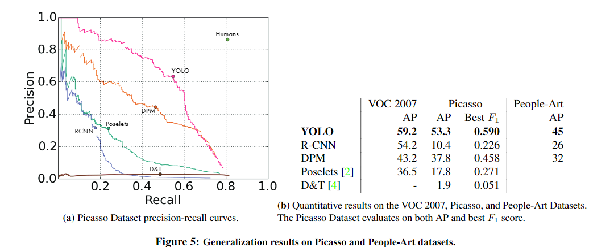

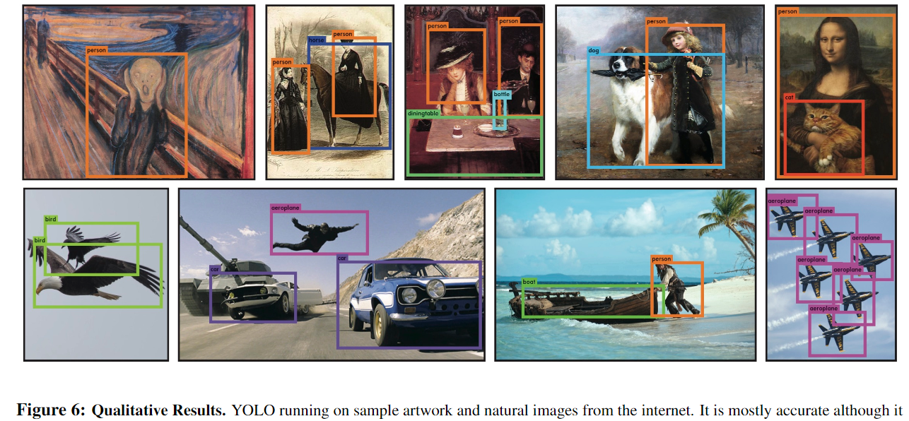

##### YOLOv2

https://arxiv.org/pdf/1612.08242

###### YOLOv2 创新点

YOLOv1虽然检测速度快，但在定位方面不够准确，并且召回率较低。为了提升定位准确度，改善召回率，YOLOv2在YOLOv1的基础上提出了几种改进策略

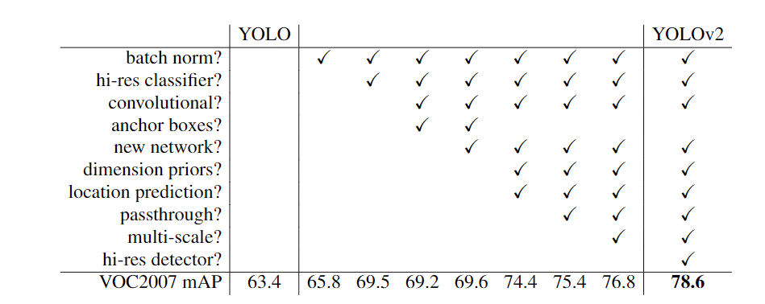

- **Batch Normalization**

YOLOv2中在每个卷积层后加Batch Normalization(BN)层，去掉dropout. BN层可以起到一定的正则化效果，能提升模型收敛速度，防止模型过拟合。YOLOv2通过使用BN层使得mAP提高了2%。

- **High Resolution Classifier** （高分辨率）

目前的大部分检测模型都会使用主流分类网络（如vgg、resnet）在ImageNet上的预训练模型作为特征提取器, 而这些分类网络大部分都是以小于 256x256 的图片作为输入进行训练的，低分辨率会影响模型检测能力。YOLOv2将输入图片的分辨率提升至448x448，为了使网络适应新的分辨率，YOLOv2先在ImageNet上以448x448的分辨率对网络进行10个epoch的微调，让网络适应高分辨率的输入。通过使用高分辨率的输入，YOLOv2的mAP提升了约4%。

- **Convolutional With Anchor Boxes** 使用 anchor box 进行卷积

YOLOv1 利用全连接层直接对边界框进行预测，导致丢失较多空间信息，定位不准。YOLOv2去掉了 YOLOv1 中的全连接层，使用 Anchor Boxes 预测边界框，同时为了得到更高分辨率的特征图，YOLOv2 还去掉了一个池化层。由于图片中的物体都倾向于出现在图片的中心位置，若特征图恰好有一个中心位置，利用这个中心位置预测中心点落入该位置的物体，对这些物体的检测会更容易。所以总希望得到的特征图的宽高都为奇数。YOLOv2 通过缩减网络，使用 416x416 的输入，模型下采样的总步长为 32，最后得到 13x13 的特征图，**然后对 13x13 的特征图的每个 cell 预测 5 个 anchor boxes**，对每个anchor box 预测边界框的位置信息、置信度和一套分类概率值。使用 anchor boxes 之后，YOLOv2可以预测 13x13x5=845个边界框，模型的召回率由原来的 81% 提升到 88%，mAP由原来的 69.5% 降低到 69.2%.召回率提升了 7%，准确率下降了0.3%。

- **New Network：Darknet-19**

YOLOv2采用 Darknet-19，其网络结构如下图所示，包括 19 个卷积层和 5 个 max pooling 层，主要采用 3x3 卷积和 1x1 卷积，**这里 1x1 卷积可以压缩特征图通道数以降低模型计算量和参数**，每个卷积层后使用 **BN 层**以加快模型收敛同时防止过拟合。最终采用global avg pool 做预测。采用 YOLOv2，模型的 mAP 值没有显著提升，但计算量减少了。

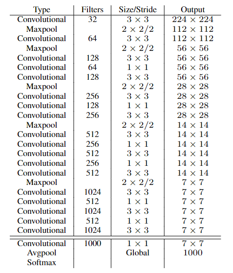

- **Dimension Clusters**  维度集群

在 Faster R-CNN 和 SSD 中，先验框都是手动设定的，带有一定的主观性。YOLOv2 采用 k-means 聚类算法对训练集中的边界框做了聚类分析，选用 boxes 之间的 IOU 值作为聚类指标。综合考虑模型复杂度和召回率，最终选择 5 个聚类中心，得到5个先验框，发现其中中扁长的框较少，而瘦高的框更多，更符合行人特征。通过对比实验，发现用聚类分析得到的先验框比手动选择的先验框有更高的平均 IOU 值，这使得模型更容易训练学习。

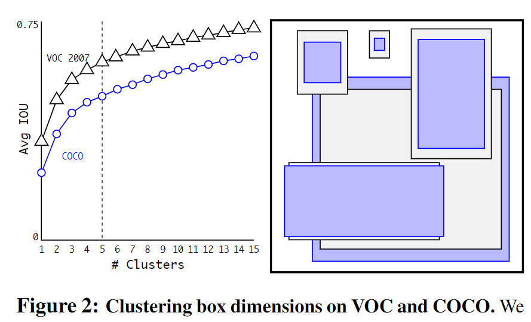

- **Direct location prediction**

Faster R-CNN 使用 anchor boxes 预测边界框相对先验框的偏移量，由于没有对偏移量进行约束，每个位置预测的边界框可以落在图片任何位置，会导致模型不稳定，加长训练时间。YOLOv2 沿用 YOLOv1 的方法，根据所在网格单元的位置来预测坐标,则 Ground Truth 的值介于 0 到 1 之间。网络中将得到的网络预测结果再输入 sigmoid 函数中，让输出结果介于 0到 1 之间。设一个网格相对于图片左上角的偏移量是 cx，cy。先验框的宽度和高度分别是 pw 和 ph，则预测的边界框相对于特征图的中心坐标 (bx，by) 和宽高 bw、bh 的计算公式如下图所示。

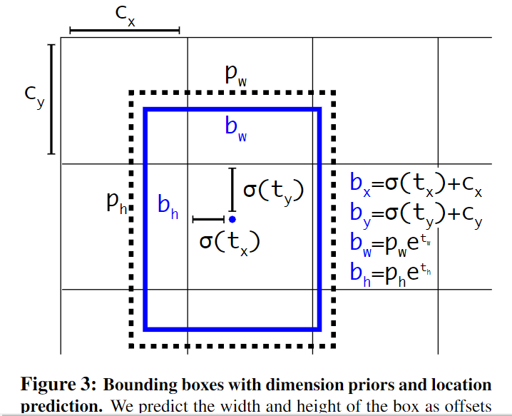

YOLOv2 结合 Dimention Clusters, 通过对边界框的位置预测进行约束，使模型更容易稳定训练，这种方式使得模型的mAP值提升了约 5%。

- **Fine-Grained Features** （细粒度特性）

YOLOv2 借鉴 SSD 使用多尺度的特征图做检测，提出 pass through 层将高分辨率的特征图与低分辨率的特征图联系在一起，从而实现多尺度检测。YOLOv2 提取 Darknet-19 最后一个 max pool 层的输入，得到 26x26x512 的特征图。经过1x1x64 的卷积以降低特征图的维度，得到 26x26x64 的特征图，然后经过 pass through 层的处理变成 13x13x256 的特征图（抽取原特征图每个2x2的局部区域组成新的channel，即原特征图大小降低 4 倍，channel 增加4倍），再与 13x13x1024 大小的特征图连接，变成 13x13x1280 的特征图，最后在这些特征图上做预测。使用 Fine-Grained Features，YOLOv2 的性能提升了1%.

- **Multi-Scale Training**

YOLOv2中使用的Darknet-19网络结构中只有卷积层和池化层，所以其对输入图片的大小没有限制。YOLOv2 采用多尺度输入的方式训练，在训练过程中每隔 10个batches ,重新随机选择输入图片的尺寸，由于Darknet-19下采样总步长为 32，输入图片的尺寸一般选择 32 的倍数 {320,352,…,608}。采用 Multi-Scale Training, 可以适应不同大小的图片输入，**当采用低分辨率的图片输入时，mAP 值略有下降，但速度更快，当采用高分辨率的图片输入时，能得到较高mAP值，但速度有所下降。**

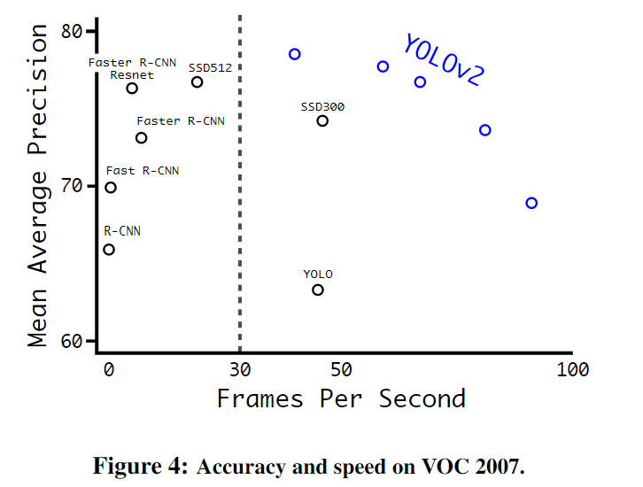

YOLOv2 借鉴了很多其它目标检测方法的一些技巧，如 Faster R-CNN 的anchor boxes, SSD中的多尺度检测。除此之外，YOLOv2在网络设计上做了很多tricks,使它能在保证速度的同时提高检测准确率，Multi-Scale Training更使得同一个模型适应不同大小的输入，从而可以在速度和精度上进行自由权衡。

###### YOLOv2 存在的问题

YOLO v2 对 YOLO v1 的缺陷进行优化，大幅度高了检测的性能，但仍存在一定的问题，**如无法解决重叠问题的分类等**。 

##### YOLOv3

https://pjreddie.com/media/files/papers/YOLOv3.pdf

###### 创新点

- 新网络结构：DarkNet-53

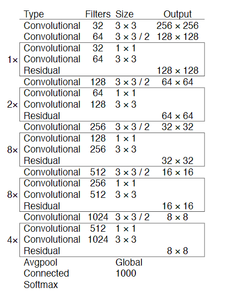

将 256x256 的图片分别输入以Darknet-19，ResNet-101，ResNet-152 和 Darknet-53 为基础网络的分类模型中，实验得到的结果如下图所示。可以看到Darknet-53比ResNet-101的性能更好，而且速度是其 1.5 倍，Darknet-53 与 ResNet-152 性能相似但速度几乎是其2倍。注意到，Darknet-53 相比于其它网络结构实现了每秒最高的浮点计算量，说明其网络结构能更好的利用 GPU。

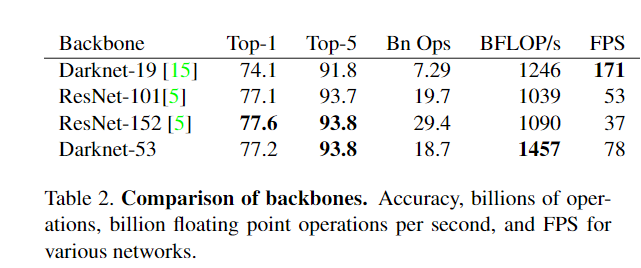

- 融合FPN

YOLOv3 借鉴了 FPN 的思想，从不同尺度提取特征。相比 YOLOv2，YOLOv3 提取最后 3 层特征图，不仅在每个特征图上分别独立做预测，同时通过将小特征图上采样到与大的特征图相同大小，然后与大的特征图拼接做进一步预测。用维度聚类的思想聚类出 9 种尺度的anchor box，将 9 种尺度的 anchor box 均匀的分配给 3 种尺度的特征图.

- 用逻辑回归替代 softmax 作为分类器

在实际应用场合中，一个物体有可能输入多个类别，单纯的单标签分类在实际场景中存在一定的限制。举例来说，一辆车它既可以属于 car（小汽车）类别，也可以属于 vehicle（交通工具），用单标签分类只能得到一个类别。因此在 YOLO v3 在网络结构中把原先的 softmax 层换成了逻辑回归层，从而实现把单标签分类改成多标签分类。用多个 logistic 分类器代替 softmax 并不会降低准确率，可以维持 YOLO 的检测精度不下降。 

##### 其他

对于对象检测，不仅要考虑精度，还要考虑实时运行的性能，虽然现在算力大幅度上升，但是普通的设备跑起来还是有点吃力。提高精度和加快速率仍是目标检测的重大课题，道阻且长！

参考：

- YOLOv1 参考
  - https://blog.csdn.net/m0_37192554/article/details/81092761
  - https://blog.csdn.net/shuiyixin/article/details/82533849
  - [https://github.com/scutan90/DeepLearning-500-questions/blob/master/ch08_%E7%9B%AE%E6%A0%87%E6%A3%80%E6%B5%8B/%E7%AC%AC%E5%85%AB%E7%AB%A0_%E7%9B%AE%E6%A0%87%E6%A3%80%E6%B5%8B.md](https://github.com/scutan90/DeepLearning-500-questions/blob/master/ch08_目标检测/第八章_目标检测.md)
  - https://mp.weixin.qq.com/s/1Fboi54DXdoOHJBMoZKVUg
- YOLOv2参考
  - https://blog.csdn.net/weixin_35654926/article/details/72473024
- YOLOv3 参考
  - https://blog.csdn.net/leviopku/article/details/82660381 ：可以详细看看
- https://mp.weixin.qq.com/s/yccBloK5pOVxDIFkmoY7xg：非极大抑制
- 《深度学习之图像识别核心技术与案例实战》作者：言有三